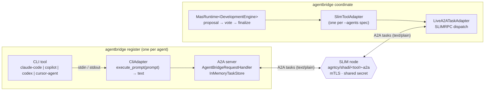
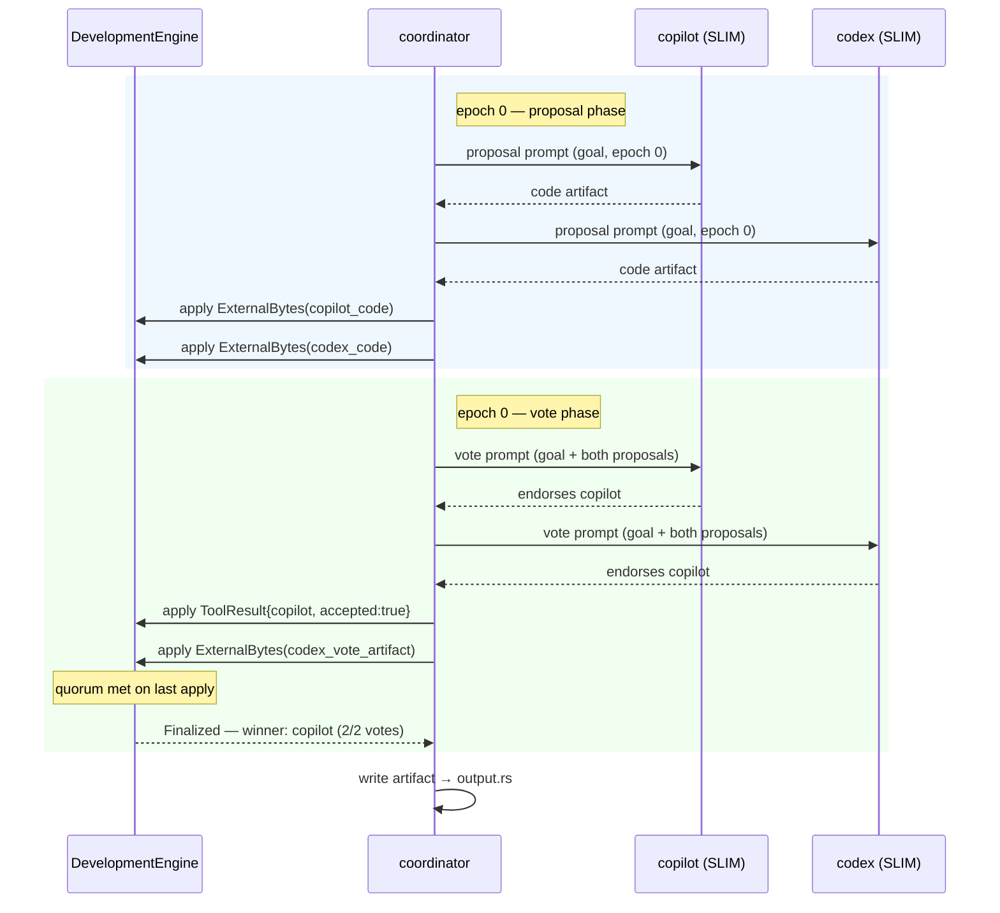
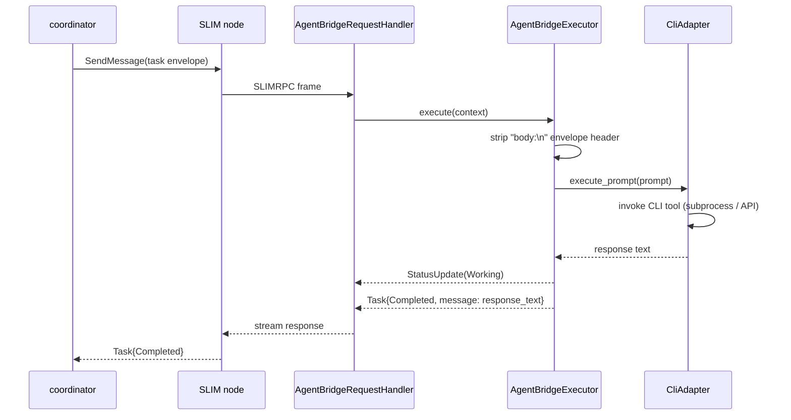

# agentbridge — Autonomous CLI Coding-Agent Interconnect

agentbridge is the layer of SHADI that connects CLI coding tools — Claude Code,
GitHub Copilot CLI, OpenAI Codex CLI, Cursor Agent, or any tool that speaks the
agentbridge subprocess protocol — so they can exchange context, delegate tasks to
each other, and coordinate autonomously until a programming goal is achieved.

## Motivation

Every major coding assistant operates in isolation. When a developer switches
tools (e.g., from Claude Code to Copilot), all conversation history, open files,
and accumulated context is lost. There is no standard way to:

- hand off an in-progress session from one tool to another,
- ask one agent to generate a specific artifact for another agent's task, or
- have multiple agents propose solutions and converge on the best one without human mediation.

agentbridge solves this using the existing SHADI infrastructure: A2A for task
delegation, SLIM for transport, DIR for discovery, and `shadi_mas` for
autonomous multi-round coordination.

## Architecture

### Deployment topology

`register` and `coordinate` run on separate hosts (or separate terminals on the
same machine). SLIM is the authenticated transport bus between them.



### Coordination loop

Each epoch has two phases: every agent proposes a code artifact, then every
agent votes on the best one. Finalization fires as soon as endorsements reach
the quorum — triggered by applying the last proposal of the epoch.



### A2A task flow inside a registered adapter



## Three interaction models

### 1. Context handoff

Export a session snapshot from one tool and import it into another. The
`ContextPacket` carries conversation history, open files, git diff, and any
generated artifacts.

```
agentbridge handoff --from ./claude-proxy --to ./copilot-proxy
```

1. Source adapter → `snapshot_context()` → `ContextPacket`
2. Packet persisted to `shadi_memory` (SQLCipher-backed, recoverable)
3. A2A Task sent to destination adapter (skill: `inject-context`)
4. Destination adapter → `inject_context(packet)`

### 2. Task delegation

One tool commissions a specific subtask to another and retrieves the artifact.

```
agentbridge delegate --to codex "write unit tests for src/parser.rs"
```

Implemented via `LiveA2ATaskAdapter::dispatch()` from `shadi_mas`. The result
is an A2A artifact containing the generated code.

### 3. Autonomous multi-round coordination

```
agentbridge coordinate \
  --goal "implement a JSON parser" \
  --agents claude-code,copilot,codex,cursor-agent \
  --quorum 3
```

1. `MasRuntime<DevelopmentEngine>` is instantiated with all four adapters.
2. Each agent invokes its CLI tool via `ToolAdapter::call()` → code proposal.
3. Proposals are published to a SLIM group session.
4. Agents vote via `SemanticPayload::ToolResult { accepted: true }`.
5. When `accepted_votes ≥ quorum` → `EventOutcome::Finalized` → loop exits.
6. The winning artifact is written to disk. Human approval is optional.

## A2A server — how `register` exposes an adapter over SLIM

When `agentbridge register` is called with `--slim-endpoint`, it starts a
full A2A server that makes the local adapter reachable to any SLIM peer.

### SLIM address

Each adapter registers under the hierarchical name:

```
agntcy/shadi/<tool>-a2a
```

For example, `--tool copilot` listens as `agntcy/shadi/copilot-a2a`. The
`coordinate` command reaches it with `--agents slim:copilot`.

### Request handler stack

```
SlimRpcHandler (shadi_a2a)          ← decodes SLIMRPC frames
  └─ AgentBridgeRequestHandler      ← full A2A protocol surface
       ├─ DefaultRequestHandler      ← routes send/get/list/cancel/subscribe/push
       │    └─ AgentBridgeExecutor   ← executes the task against the CliAdapter
       └─ InMemoryTaskStore          ← stores task state for get/list operations
```

`AgentBridgeRequestHandler` implements all A2A request methods and delegates
to `DefaultRequestHandler` for everything except `get_extended_agent_card`,
which returns a static `AgentCard` describing the adapter:

| Field | Value |
|-------|-------|
| `capabilities.streaming` | `true` |
| `capabilities.push_notifications` | `false` |
| `default_input_modes` | `["text/plain"]` |
| `default_output_modes` | `["text/plain"]` |

### Task execution flow

See the [A2A task flow sequence diagram](#a2a-task-flow-inside-a-registered-adapter)
above. The executor streams two events: a `Working` status update followed by a
`Completed` task carrying the adapter's response text as a `text/plain` part.
Task history (the original prompt message) is included in the completed task.

### TLS certificate resolution

The listener needs a client-side mTLS certificate to authenticate with the
SLIM node. Resolution order:

1. **Explicit env vars** — `SLIM_TLS_CERT` + `SLIM_TLS_KEY` + `SLIM_TLS_CA`
2. **Agent-specific fallback** — `.tmp/shadi-slim-mtls/client-<agent_id>.crt` / `.key`
3. **Generic fallback** — `.tmp/shadi-slim-mtls/client.crt` / `.key`

`SLIM_TLS_CA` defaults to `.tmp/shadi-slim-mtls/ca.crt`. Generate the
certificate bundle once with `tools/generate_slim_mtls_certs.sh`.

### Lifecycle

```
register --slim-endpoint 127.0.0.1:47357
  │
  ├─ Service::connect()      connect to SLIM node (TLS 1.3)
  ├─ create_app_with_secret() authenticate with shared secret
  ├─ app.subscribe()         subscribe to agntcy/shadi/<tool>-a2a
  ├─ Server::serve_async()   start the A2A/SLIMRPC event loop
  │
  │  [agentbridge] ready — listening on agntcy/shadi/<tool>-a2a
  │
  ├─ … handles tasks until Ctrl-C …
  │
  └─ app.unsubscribe()       deregister from the SLIM topic
     service.disconnect()    close the SLIM connection
     service.shutdown()      clean up
```

### Wiring to `coordinate`

The `coordinate` command uses `slim:<agent-id>` specs to reach registered
adapters. It constructs a `LiveA2ATaskAdapter` per spec, which speaks the
same SLIMRPC protocol to the listening server:

```
coordinate --agents slim:copilot,slim:codex
  │
  ├─ LiveA2ATaskAdapter { peer: agntcy/shadi/copilot-a2a }
  └─ LiveA2ATaskAdapter { peer: agntcy/shadi/codex-a2a }
        │
        └─ SlimToolAdapter::call() → dispatch() → receives Task(Completed)
```

The A2A traffic is printed with `┌─ A2A ─→` / `┌─ A2A ←─` banners showing
the agent ID, coordination phase, epoch, and elapsed milliseconds.

## Security model

agentbridge executes real coding tools on your machine and reaches them over a
shared SLIM bus, so two trust boundaries matter.

### The register listener is a remote-execution surface

A registered adapter forwards every incoming A2A task straight to the local CLI
tool (`execute_prompt` → subprocess). Some adapters run their tool with elevated
permissions — for example, `CopilotAdapter` invokes `copilot --allow-all-tools`
so it can act non-interactively. **Any peer able to reach
`agntcy/shadi/<tool>-a2a` on the SLIM node can therefore drive local code
execution.**

Controls:

- The listener prints a warning on start-up naming the tool that will execute
  incoming tasks.
- Only expose the listener to trusted SLIM peers. Run agents inside the SHADI
  [sandbox](sandbox.md) so tool execution is confined by OS policy.
- Keep the SLIM node on loopback (`127.0.0.1`) for local demos; only bind a
  routable address when the peer set is trusted and authenticated.

### Shared secret

SLIM apps authenticate with a shared secret (`create_app_with_secret`). For the
loopback demo, `register`, `delegate`, and `coordinate` fall back to a built-in
default secret (`my_shared_secret_for_testing_purposes_only`) when
`SLIM_SHARED_SECRET` is unset.

!!! danger "The default secret provides no authentication"
    The default is compiled into the binary and is public. It is safe **only**
    for a loopback demo. The commands emit a security warning when the default
    is used, and warn more loudly when the endpoint is not loopback. Always set
    `SLIM_SHARED_SECRET` (or `--slim-shared-secret`) to a private value before
    exposing the SLIM node.

### Transport authentication

Peer-to-peer A2A traffic runs over SLIMRPC with mutual TLS. The listener resolves
a client certificate from `SLIM_TLS_CERT` / `SLIM_TLS_KEY` / `SLIM_TLS_CA`, an
agent-specific fallback, or a generic fallback (see
[TLS certificate resolution](#tls-certificate-resolution)). Generate the bundle
with `tools/generate_slim_mtls_certs.sh` and keep the CA private to the peers you
trust.

## `DevelopmentEngine` — the coordination core

`DevelopmentEngine` is a `CoordinationEngine` that coordinates code artifacts
rather than scalar numeric values (unlike `PreferenceEngine`).

| Event | Payload | Effect |
|-------|---------|--------|
| Code proposal | `ExternalBytes(code)` | Stored keyed by source agent |
| Endorsement vote | `ToolResult { accepted: true, tool_name: agent_id }` | Votes tallied per artifact |
| Other payloads | any | Accepted silently (applied) |
| Finalization | — | Artifact with most votes wins; epoch advances |
| Max rounds exceeded | — | Force-finalizes with current best artifact |

Epoch discipline prevents duplicate, stale, and future-epoch events from
corrupting the state machine.

## Goal analysis: what was asked for vs. what is built

### Original goal

> "Write a new application to interconnect Claude CLI, Copilot CLI, Codex CLI or
> other similar applications to exchange context or messages, artifacts etc.
> Use the A2A protocol, SLIM/shadi for transport, and DIR to discover each other.
> Make agents coordinate with a goal and work in autonomy until the work is achieved."

### What is implemented

| Requirement | Status | Detail |
|-------------|--------|--------|
| Architecture design | ✅ | Full A2A + SLIM + DIR stack documented |
| Coordination backbone | ✅ | `shadi_mas` migrated + `DevelopmentEngine` added |
| `CliAdapter` trait | ✅ | Unified interface for any coding tool |
| `ContextPacket` | ✅ | Portable session snapshot with JSON serde |
| Generic subprocess adapter | ✅ | `GenericStdioAdapter` — newline-delimited JSON protocol |
| Native adapters | ✅ | `ClaudeCodeAdapter`, `CopilotAdapter`, `CodexAdapter`, `CursorAgentAdapter` |
| `CliToolAdapter` bridge | ✅ | Any `CliAdapter` → `shadi_mas::ToolAdapter` |
| DIR registration | ✅ | OASF record builder + `dirctl push/search` via subprocess |
| `agentbridge` library | ✅ | `crates/agentbridge` |
| CLI binary | ✅ | `agentbridge register \| list \| handoff \| delegate \| coordinate` |
| Live A2A transport | ✅ | `LiveA2ATaskAdapter` wired into `register` and `coordinate` |
| Quorum-vote finalization | ✅ | `DevelopmentEngine` — autonomous, no human required |

### What remains

| Requirement | Detail |
|-------------|--------|
| `shadi_memory` ContextPacket persistence | `SqlCipherStore` wire-up in `crates/shadi_memory/` |
| SLIM group relay | `LiveSlimGroupConfig` + `LiveSlimMessagingAdapter::group()` for broadcast |

### Does the existing middleware help?

**Yes — substantially.** Every component of the target architecture existed or
was extended from existing SHADI infrastructure:

- **A2A**: `shadi_a2a::A2AChannelBuilder` and `a2a-slimrpc` provide identity-verified A2A over SLIMRPC. `LiveA2ATaskAdapter` in `shadi_mas` is a ready-made task dispatcher.
- **SLIM**: `agent_transport_slim::NativeSlimSession` and `LiveSlimMessagingAdapter` provide group and point-to-point messaging. The `LiveSlimGroupSender` handles multi-agent broadcast with receipt acknowledgements.
- **DIR**: `shadictl dir` subcommand already integrates with `agntcy/dir`. OASF records are the natural format for adapter agent cards.
- **shadi_mas**: The `DevelopmentEngine` required a new `PatternKind` and engine implementation, but the runtime, epoch discipline, adapter traits, and test infrastructure were already in place.
- **shadi_memory**: `SqlCipherStore` provides encrypted `ContextPacket` persistence with no additional code.

The middleware was designed for exactly this use case. The agentbridge application is an adapter layer on top of an existing, tested coordination stack.

## File map

```
crates/
  agentbridge/              ← library
    src/
      adapter.rs           ← CliAdapter trait + CliToolAdapter
      context.rs           ← ContextPacket, CodeContext, ArtifactPayload
      dir_registry.rs      ← OASF record builder + dirctl integration
      adapters/
        generic_stdio.rs   ← subprocess JSON protocol adapter
        claude_code.rs     ← Claude Code native adapter
        copilot.rs         ← GitHub Copilot CLI adapter
        codex.rs           ← OpenAI Codex CLI adapter
        cursor_agent.rs    ← Cursor Agent adapter
  agentbridge_cli/          ← binary (agentbridge)
    src/
      main.rs
      commands/
        register.rs        ← register + SLIM A2A listener
        list.rs
        handoff.rs
        delegate.rs        ← single-shot A2A dispatch
        coordinate.rs      ← MasRuntime<DevelopmentEngine> loop
  shadi_mas/               ← coordination runtime
    src/
      engines/
        development.rs     ← DevelopmentEngine
        preference.rs      ← PreferenceEngine (existing)
      experiments/
        mod.rs             ← live adapters + experiment runners
    tests/
      integration_slim.rs  ← SLIM node integration tests (run with --include-ignored)
examples/
  agentbridge_demo/         ← self-contained demo (no infrastructure needed)
```

## Quick start

```bash
# Run the self-contained demo (all scenarios, no infrastructure required)
cargo run -p agentbridge_demo

# Run the 4-agent coordination scenario
cargo run -p agentbridge_demo -- --scenario coordination

# Run the context handoff scenario
cargo run -p agentbridge_demo -- --scenario handoff

# Run the CliAdapter → ToolAdapter bridge scenario
cargo run -p agentbridge_demo -- --scenario bridge
```

See [examples/agentbridge_demo/README.md](../examples/agentbridge_demo/README.md)
for step-by-step instructions and the live 4-terminal SLIM demo.
