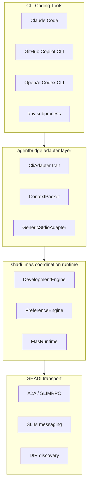

# Codebridge — Autonomous CLI Coding-Agent Interconnect

Codebridge is the layer of SHADI that connects CLI coding tools — Claude Code,
GitHub Copilot CLI, OpenAI Codex CLI, or any tool that speaks the agentbridge
subprocess protocol — so they can exchange context, delegate tasks to each other,
and coordinate autonomously until a programming goal is achieved.

## Motivation

Every major coding assistant operates in isolation. When a developer switches
tools (e.g., from Claude Code to Copilot), all conversation history, open files,
and accumulated context is lost. There is no standard way to:

- hand off an in-progress session from one tool to another,
- ask one agent to generate a specific artifact for another agent's task, or
- have multiple agents propose solutions and converge on the best one without human mediation.

Codebridge solves this using the existing SHADI infrastructure: A2A for task
delegation, SLIM for transport, DIR for discovery, and `shadi_mas` for
autonomous multi-round coordination.

## Stack overview



## Three interaction models

### 1. Context handoff

Export a session snapshot from one tool and import it into another. The
`ContextPacket` carries conversation history, open files, git diff, and any
generated artifacts.

```
agentbridge handoff --from ./claude-proxy --to ./copilot-proxy
```

1. Source adapter → `snapshot_context()` → `ContextPacket`
2. Packet persisted to `shadi_memory` (SQLCipher-backed, recoverable)
3. A2A Task sent to destination adapter (skill: `inject-context`)
4. Destination adapter → `inject_context(packet)`

### 2. Task delegation

One tool commissions a specific subtask to another and retrieves the artifact.

```
agentbridge delegate --to codex "write unit tests for src/parser.rs"
```

Implemented via `LiveA2ATaskAdapter::dispatch()` from `shadi_mas`. The result
is an A2A artifact containing the generated code.

### 3. Autonomous multi-round coordination (Phase 3)

```
agentbridge coordinate --agents claude,copilot,codex --goal "implement a JSON parser"
```

1. `MasRuntime<DevelopmentEngine>` is instantiated with all three adapters.
2. Each agent invokes its CLI tool via `ToolAdapter::call()` → code proposal.
3. Proposals are published to a SLIM group session.
4. Agents vote via `SemanticPayload::ToolResult { accepted: true }`.
5. When `accepted_votes ≥ quorum` → `EventOutcome::Finalized` → loop exits.
6. The winning artifact is written to disk. Human approval is optional.

## `DevelopmentEngine` — the coordination core

`DevelopmentEngine` is a `CoordinationEngine` that coordinates code artifacts
rather than scalar numeric values (unlike `PreferenceEngine`).

| Event | Payload | Effect |
|-------|---------|--------|
| Code proposal | `ExternalBytes(code)` | Stored keyed by source agent |
| Endorsement vote | `ToolResult { accepted: true, tool_name: agent_id }` | Votes tallied per artifact |
| Other payloads | any | Accepted silently (applied) |
| Finalization | — | Artifact with most votes wins; epoch advances |
| Max rounds exceeded | — | Force-finalizes with current best artifact |

Epoch discipline prevents duplicate, stale, and future-epoch events from
corrupting the state machine.

## Goal analysis: what was asked for vs. what is built

### Original goal

> "Write a new application to interconnect Claude CLI, Copilot CLI, Codex CLI or
> other similar applications to exchange context or messages, artifacts etc.
> Use the A2A protocol, SLIM/shadi for transport, and DIR to discover each other.
> Make agents coordinate with a goal and work in autonomy until the work is achieved."

### What is implemented (Phase 1)

| Requirement | Status | Detail |
|-------------|--------|--------|
| Architecture design | ✅ | Full A2A + SLIM + DIR stack documented |
| Coordination backbone | ✅ | `shadi_mas` migrated + `DevelopmentEngine` added |
| `CliAdapter` trait | ✅ | Unified interface for any coding tool |
| `ContextPacket` | ✅ | Portable session snapshot with JSON serde |
| Generic subprocess adapter | ✅ | `GenericStdioAdapter` — newline-delimited JSON protocol |
| `CliToolAdapter` bridge | ✅ | Any `CliAdapter` → `shadi_mas::ToolAdapter` |
| `agentbridge` library | ✅ | `crates/agentbridge` |
| CLI binary | ✅ | `agentbridge register \| list \| handoff` |
| Quorum-vote finalization | ✅ | `DevelopmentEngine` — autonomous, no human required |
| 86 tests, 90% coverage | ✅ | Including SLIM integration tests |

### What remains (Phase 2 and 3)

| Requirement | Phase | Detail |
|-------------|-------|--------|
| `claude-code` native adapter | 2 | MCP stdio bridge pattern from `agent_transport_slim` |
| `delegate` command | 2 | `LiveA2ATaskAdapter::dispatch()` already available in shadi_mas |
| DIR registration/discovery | 2 | `shadictl dir` subcommand already wired; OASF record builder needed |
| `copilot` / `codex` adapters | 3 | Subprocess bridges to their native protocols |
| `coordinate` command | 3 | `MasRuntime<DevelopmentEngine>` loop + SLIM group relay |
| Real-time relay/broadcast | 3 | `LiveSlimMessagingAdapter::group()` + `LiveSlimGroupSender` |
| `shadi_memory` persistence | 3 | `SqlCipherStore` already available; handoff command uses it first |

### Does the existing middleware help?

**Yes — substantially.** Every component of the target architecture existed or
was extended from existing SHADI infrastructure:

- **A2A**: `shadi_a2a::A2AChannelBuilder` and `a2a-slimrpc` provide identity-verified A2A over SLIMRPC. `LiveA2ATaskAdapter` in `shadi_mas` is a ready-made task dispatcher.
- **SLIM**: `agent_transport_slim::NativeSlimSession` and `LiveSlimMessagingAdapter` provide group and point-to-point messaging. The `LiveSlimGroupSender` handles multi-agent broadcast with receipt acknowledgements.
- **DIR**: `shadictl dir` subcommand already integrates with `agntcy/dir`. OASF records are the natural format for adapter agent cards.
- **shadi_mas**: The `DevelopmentEngine` required a new `PatternKind` and engine implementation, but the runtime, epoch discipline, adapter traits, and test infrastructure were already in place.
- **shadi_memory**: `SqlCipherStore` provides encrypted `ContextPacket` persistence with no additional code.

The middleware was designed for exactly this use case. The agentbridge application is an adapter layer (≈ 600 lines) on top of an existing, tested coordination stack.

## File map

```
crates/
  agentbridge/              ← library
    src/
      adapter.rs           ← CliAdapter trait + CliToolAdapter
      context.rs           ← ContextPacket, CodeContext, ArtifactPayload
      adapters/
        generic_stdio.rs   ← subprocess JSON protocol adapter
  agentbridge_cli/          ← binary
    src/
      main.rs
      commands/
        register.rs
        list.rs
        handoff.rs
  shadi_mas/               ← coordination runtime
    src/
      engines/
        development.rs     ← DevelopmentEngine (new)
        preference.rs      ← PreferenceEngine (existing)
      experiments/
        mod.rs             ← live adapters + experiment runners
    tests/
      integration_slim.rs  ← SLIM node integration tests
examples/
  agentbridge_demo/         ← self-contained demo (no infrastructure needed)
```

## Quick start

```bash
# Run the self-contained demo
cargo run -p agentbridge_demo

# Run the coordination demo with 3 mock agents
cargo run -p agentbridge_demo -- --scenario coordination

# Run the handoff demo
cargo run -p agentbridge_demo -- --scenario handoff
```

See [examples/agentbridge_demo/README.md](../examples/agentbridge_demo/README.md)
for step-by-step instructions.
