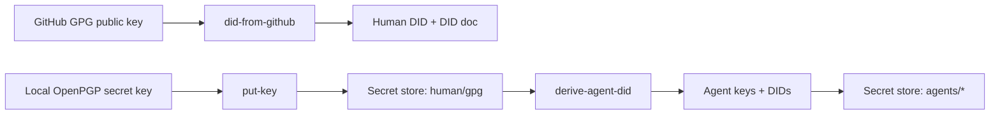

# API and Integration Guide

This guide describes SHADI APIs and integration patterns for applications.

## Quickstart flow

```bash
# 1) Fetch human public key from GitHub and store DID artifacts.
cargo run -p shadictl -- did-from-github --user alice --out human.did.json

# 2) Store the human OpenPGP secret key locally.
cargo run -p shadictl -- put-key --key human/gpg --in /path/to/human-secret.asc

# 3) Derive agent identities and keys.
cargo run -p shadictl -- derive-agent-did --secret human/gpg --name agent-a --prefix agents
```



## Listing context and long-term memory

To list secrets stored for an app or agent, use `shadictl`:

```bash
cargo run -p shadictl -- --list-keychain --list-prefix agents/
cargo run -p shadictl -- --list-keychain --list-prefix secops/
```

Avoid printing secret values. Pass key names to helpers that resolve secrets
inside SHADI.

To list or search long-term memory in the encrypted SQLCipher store, use the
`shadictl memory` helper so keys stay in SHADI:

```bash
cargo run -p shadictl -- -- memory list \
  --db "${SHADI_TMP_DIR:-./.tmp}/shadi-memory.db" \
  --key-name shadi/memory/sqlcipher_key \
  --scope secops --limit 50
```

```bash
cargo run -p shadictl -- -- memory search \
  --db "${SHADI_TMP_DIR:-./.tmp}/shadi-memory.db" \
  --key-name shadi/memory/sqlcipher_key \
  --scope secops --query dependabot --limit 10
```

## Integration overview

Most applications integrate SHADI in three layers:

1. **Identity and session verification**: validate a DID/VC presentation.
2. **Secrets access**: gate reads and writes to the secret store.
3. **Sandbox execution** (optional): run agents with OS-level restrictions.

## Rust API

The Rust integration surface lives in `agent_secrets`.

### Core traits and types

- `SecretStore`: storage backend (platform keychain by default).
- `AgentVerifier`: verifies a session before secret access.
- `SessionContext`: session metadata used by `AgentVerifier`.
- `AgentSecretAccess`: gatekeeper for per-session secret access.
- `SecretPolicy`: per-secret policy metadata (currently default only).
- `SecretBytes`: zeroizing wrapper for secret material.

### Example: verify then access secrets

```rust
use agent_secrets::{
    AgentSecretAccess, AgentVerifier, SecretError, SecretPolicy, SessionContext,
};

struct AllowVerifier;

impl AgentVerifier for AllowVerifier {
    fn verify(&self, session: &SessionContext) -> Result<(), SecretError> {
        if session.verified {
            Ok(())
        } else {
            Err(SecretError::NotAuthorized)
        }
    }
}

fn main() -> Result<(), SecretError> {
    let store = agent_secrets::default_store();
    let verifier = AllowVerifier;
    let access = AgentSecretAccess::new(store.as_ref(), &verifier);

    let mut session = SessionContext::new("agent-1", "session-1");
    session.verified = true;

    access.put_for_session(&session, "secops/token", b"secret", SecretPolicy::default())?;
    let secret = access.get_for_session(&session, "secops/token")?;
    let value = secret.expose(|bytes| bytes.to_vec());

    println!("secret len: {}", value.len());
    Ok(())
}
```

### SessionContext fields

`SessionContext` includes:

- `agent_id`: logical agent identifier
- `session_id`: per-session identifier
- `verified`: whether verification succeeded
- `claims`: list of DID/VC claims

Your verifier should set `verified` after validating a DID/VC presentation.

## Python API

The Python bindings are provided by `shadi_py` and expose `ShadiStore`,
`PySessionContext`, `SqlCipherMemoryStore`, `SandboxPolicyHandle`, and
`run_sandboxed`.

### Installing the bindings

Install the extension module into the current Python environment with maturin:

```bash
uv run maturin develop --manifest-path crates/shadi_py/Cargo.toml
```

For Rust-only builds, use:

```bash
just build
```

### Example: Python secret access

```python
from shadi import ShadiStore, PySessionContext

store = ShadiStore()

# Provide a verification callback.
# It receives: agent_id, session_id, presentation_bytes, claims.
store.set_verifier(lambda agent_id, session_id, presentation, claims: True)

session = PySessionContext("agent-1", "session-1")
store.verify_session(session, b"didvc-presentation")

store.put(session, "secops/token", b"secret")
print(store.get(session, "secops/token"))
store.delete(session, "secops/token")
```

### Example: integrate with an app session

```python
from shadi import ShadiStore, PySessionContext

def verify_didvc(agent_id, session_id, presentation, claims):
  # Replace with real DID/VC validation.
  return True

store = ShadiStore()
store.set_verifier(verify_didvc)

session = PySessionContext("agent-1", "session-1")
ok = store.verify_session(session, b"presentation-bytes")
if not ok:
  raise RuntimeError("verification failed")

# Secrets are now gated by the verified session.
store.put(session, "app/config", b"value")
```

### Verification flow

- `set_verifier(callable)` installs a DID/VC verifier callback.
- `verify_session(session, presentation)` calls the verifier and sets
  `session.verified = True` if the callback returns truthy.
- `put/get/delete/list_keys` require a verified session.

### Example: SQLCipher memory (Python)

```python
from shadi import SqlCipherMemoryStore

store = SqlCipherMemoryStore(
  db_path="./.tmp/shadi-secops/secops_memory.db",
  key_name="secops/memory_key",
)

store.put("secops", "security_report", "{\"status\":\"ok\"}")
latest = store.get_latest("secops", "security_report")
print(latest.payload if latest else "no entry")
```

### Example: sandboxed execution (Python)

```python
from shadi import SandboxPolicyHandle, run_sandboxed

policy = SandboxPolicyHandle()
policy.allow_read_path(".")
policy.allow_write_path("./.tmp")
policy.block_network(False)

run_sandboxed(["/usr/bin/env", "python", "-V"], policy)
```

## Key provisioning for agents

Use `shadictl` to ingest OpenPGP keys and derive agent DIDs without invoking
OS `gpg`:

```bash
cargo run -p shadictl -- \
  put-key --key human/gpg --in /path/to/human-secret.asc

cargo run -p shadictl -- \
  derive-agent-did --secret human/gpg --name agent-a --prefix agents
```

Generated keys and DID artifacts are stored under:

- `agents/agent-a/private`
- `agents/agent-a/public`
- `agents/agent-a/did`
- `agents/agent-a/diddoc`

## End-to-end flow: GitHub GPG identity to agent DIDs

This flow starts from a human's GitHub GPG identity and produces a collection
of agent DIDs and key material stored in the SHADI secret store.

1) Fetch the public OpenPGP key from GitHub and create a DID document:

```bash
cargo run -p shadictl -- \
  did-from-github --user alice --out human.did.json
```

This stores the human DID and DID document under:

- `github/alice/did`
- `github/alice/diddoc`

2) Import the human OpenPGP secret key locally (private material never comes
from GitHub):

```bash
cargo run -p shadictl -- \
  put-key --key human/gpg --in /path/to/human-secret.asc
```

3) Derive agent identities and keys from the human secret key:

```bash
cargo run -p shadictl -- \
  derive-agent-did --secret human/gpg --name agent-a --prefix agents

cargo run -p shadictl -- \
  derive-agent-did --secret human/gpg --name agent-b --prefix agents
```

Each derived agent writes keys and DID artifacts to:

- `agents/<agent>/private`
- `agents/<agent>/public`
- `agents/<agent>/did`
- `agents/<agent>/diddoc`

4) In your app, verify sessions using the human DID/VC and then grant secrets
access to the agent sessions.

## Secret store naming in Rust vs Python

Rust and Python use the same underlying SHADI secret store. The "name" you see
in examples is just the secret key string (for example, `secops/token` or
`agents/agent-a/did`). There is no separate store per language.

If you see different names between Rust and Python examples, it is only a
convention difference. Pick a shared key naming scheme and use it consistently
across both runtimes.

## Sandbox integration (fundamental)

The sandbox launcher is a core SHADI feature. Agents should run under an OS
sandbox by default to enforce least-privilege execution.

Invoke `shadictl` with policy flags and a command to execute:

```bash
cargo run -p shadictl -- \
  --allow . \
  --read / \
  --net-block \
  -- \
  ./your-agent --arg value
```

For Python agents, you can run under the sandbox using the JSON policy runner:

```bash
./.venv/bin/python tools/run_sandboxed_agent.py \
  --policy policies/demo/secops-a.json \
  -- ./.venv/bin/python agents/secops/a2a_server.py
```

`net_allow` in the policy file is enforced by the Python runner using a
best-effort network guard (not OS-enforced).

If keychain access is restricted in the sandbox, broker a secret outside the
sandbox and inject it as an environment variable:

```bash
cargo run -p shadictl -- \
  --inject-keychain secops/token=GITHUB_TOKEN \
  -- \
  ./your-agent
```

## Error handling

Rust APIs return `SecretError`:

- `NotAuthorized`: session verification failed
- `InvalidInput`: key does not exist or malformed input
- `StorageFailure`: backend failure or OS error

In Python, these errors are reported as `RuntimeError` with the same message.

## Recommended integration steps

1. Generate or import a human OpenPGP key and store it with `put-key`.
2. Derive agent DIDs and keypairs with `derive-agent-did`.
3. Implement a DID/VC verification callback in your app.
4. Set `session.verified = true` only after verification succeeds.
5. Use `AgentSecretAccess` (Rust) or `ShadiStore` (Python) to access secrets.
6. Run the agent under a sandbox policy if needed.
