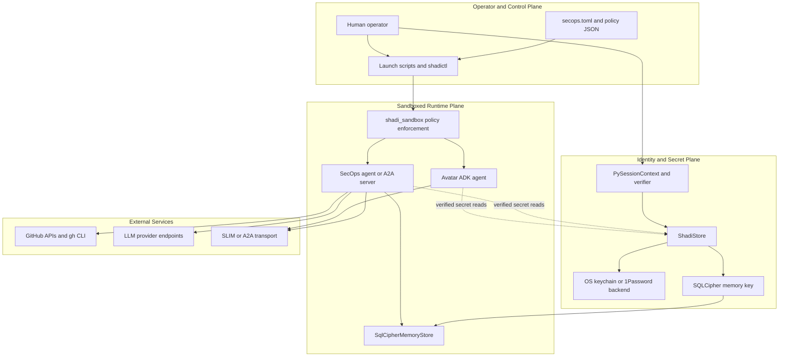
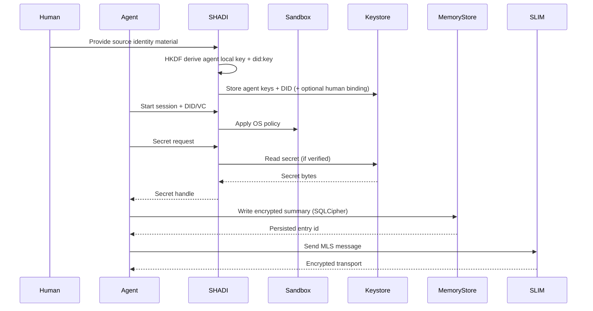
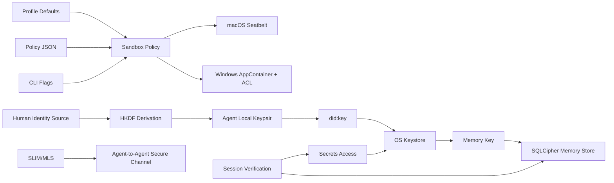

# Architecture

SHADI (Secure Host Agentic AI Dynamic Instantiation) is a secure host runtime for
interactive, autonomous agents. It combines secure secret storage, verified
identity, and kernel-enforced sandboxing to reduce the blast radius of agent
actions and prevent unauthorized data access or exfiltration.

## Goals
- Run dynamic, interactive agents with least-privilege access.
- Protect secrets at rest and limit access to verified sessions.
- Enforce kernel-level restrictions so unauthorized operations are blocked by the OS.
- Provide secure, low-latency agent-to-agent messaging via MLS.
- Keep platform support across macOS, Windows, and mobile targets.

## Non-goals
- Protect against a fully compromised host OS or kernel.
- Provide complete metadata privacy for network traffic in v1.
- Replace upstream MLS or OS keystore implementations.

## Core components

### 1) Secrets layer
- **OS keystores**: Keychain (macOS/iOS), DPAPI/CNG (Windows), Keystore (Android),
  Secret Service (Linux).
- **1Password backend** (optional): Cross-platform secret storage via the `op` CLI.
  Enabled with the `onepassword` Cargo feature and `SHADI_SECRET_BACKEND=onepassword`.
  Supports team/shared vaults and headless CI via `OP_SERVICE_ACCOUNT_TOKEN`.
- **Access control**: Secrets are accessed only after DID/VC verification.
- **Memory safety**: Secrets are wrapped in `SecretBytes` and zeroized on drop.
- **OpenPGP parsing**: `shadictl` uses `sequoia-openpgp` to ingest keys without calling OS `gpg`.

#### Key modules
- `crates/agent_secrets/src/lib.rs`: `SecretStore` trait, errors, and default store.
- `crates/agent_secrets/src/agent.rs`: `AgentSecretAccess` gates reads/writes on verification.
- `crates/agent_secrets/src/memory.rs`: `SecretBytes` zeroization wrapper.
- `crates/agent_secrets/src/platform`: platform keychain backends.
- `crates/agent_secrets/src/platform/macos.rs`: Keychain storage + key registry for listing.
- `crates/agent_secrets/src/platform/onepassword.rs`: 1Password backend via `op` CLI.
- `crates/shadictl/src/main.rs`: OpenPGP ingestion, DID derivation, and secret store helpers.

### 1b) Identity derivation and provenance
- **Deterministic derivation**: Agent keys are derived from human identity material
  through a fixed KDF pipeline.
- **KDF details**: HKDF-SHA256 with salt `shadi-agent-derive`, IKM from human
  source bytes (`gpg` or `seed`), and `agent_name` as HKDF info.
- **Output model**: 32-byte Ed25519 seed -> local agent keypair -> `did:key` DID document.
- **Provenance binding**: Optional `{prefix}/{agent}/human_did` binding allows
  explicit linkage from derived agent identity back to a stored human DID.
- **Verification command**: `verify-agent-identity` recomputes derived key + DID
  and compares with stored values; can also enforce human DID binding checks.

#### Key modules
- `crates/shadictl/src/main.rs`: `derive-agent-did`, `derive-agent-identity`,
  `verify-agent-identity`, and derivation helpers.

### 2) Sandbox layer
- **macOS**: Seatbelt profile enforcement for filesystem and network policies.
- **Windows**: AppContainer + ACL allowlists + Job Objects (kill-on-close).
- **CLI**: `shadi` provides JSON policy loading, profile defaults, optional command blocklists, and brokered secret injection.
- **Portable launcher model**: `shadi` supports built-in profiles
  (`strict`, `balanced`, `connected`) for portable secure launch defaults.
- **Launch-time enforcement**: Policy is resolved before the agent process starts, so the sandbox is not a prompt-level suggestion that the agent can rewrite from inside the session.
- **Operational hardening**: macOS launcher support now resolves relative paths before emitting Seatbelt rules and accounts for required local IPC paths such as 1Password and SLIM runtime state.

#### Key modules
- `crates/shadi_sandbox/src/policy.rs`: policy model and helpers.
- `crates/shadi_sandbox/src/platform`: OS-specific sandbox enforcement.
- `crates/shadictl/src/main.rs`: CLI parsing, policy resolution, and key listing.

### 3) Memory layer
- **Local encrypted store**: SQLCipher-backed SQLite for portable, on-device memory.
- **Key management**: Encryption keys live in SHADI secrets (keychain backed).
- **Agent usage**: workloads running on SHADI can persist local state in the encrypted store; the SecOps demo writes summaries there, while ADK memory remains in-process unless configured for persistent backends.

#### Key modules
- `crates/shadi_memory/src/lib.rs`: SQLCipher store and query helpers.
- `crates/shadi_memory/src/main.rs`: shadi-memory CLI.
- `crates/shadictl/src/main.rs`: `shadictl memory` helper.
- `crates/shadi_py/src/lib.rs`: SQLCipher bindings.
- `agents/secops/skills.py`: example summary persistence used by the SecOps demo.

### 4) Transport layer
- **SLIM/A2A**: MLS provides confidentiality and integrity between agents.
- **Verified sessions**: Messages are only sent/received after DID/VC checks.

#### Key modules
- `crates/agent_transport_slim/src/lib.rs`: transport adapter and verifier gating.

### 5) Brokered secret injection (optional)
- If sandbox rules prevent keystore access, secrets can be brokered outside the
  sandbox and injected as environment variables into the agent process.
- This is also the fallback path used by the demo launchers when the optional
  1Password backend is enabled: required items are read in the foreground and
  exported into the sandboxed process environment.

#### Key modules
- `crates/shadictl/src/main.rs`: `--inject-keychain` and policy enforcement.

## Python bindings
SHADI exposes a Python extension for secrets, SQLCipher memory, and sandbox
execution.

#### Key modules
- `crates/shadi_py/src/lib.rs`: `ShadiStore`, `PySessionContext`,
  `SqlCipherMemoryStore`, `SandboxPolicyHandle`, and `run_sandboxed` bindings.

#### Python API surface
- `ShadiStore.set_verifier(callable)` to supply DID/VC verification logic.
- `ShadiStore.verify_session(session, presentation)` to set verified sessions.
- `ShadiStore.get/put/delete` for secret access.
- `ShadiStore.list_keys` to enumerate stored keys (backed by key registry on macOS).
- `SqlCipherMemoryStore` for encrypted local memory.
- `SandboxPolicyHandle` + `run_sandboxed` for sandbox execution.

## CLI policy resolution
The CLI combines profile defaults, policy file settings, and explicit flags:
- Profile defaults are loaded first (`balanced` by default).
- Policy file values are merged next.
- CLI flags override or extend resulting policy.
- The effective policy can be printed with `--print-policy`.

## Demo workload: SecOps agent
The SecOps agent is an example workload that runs on top of SHADI. It uses the
Python bindings for secrets plus GitHub APIs for security signals, but it is
not part of the core runtime itself.

#### Key modules
- `agents/secops/skills.py`: skills to collect alerts and issues.
- `agents/secops/secops.py`: runner invoking the skill.
- `agents/secops/adk_agent/agent.py`: Google ADK agent.
- `agents/secops/SKILL.md`: Agent Skills spec metadata and runbook.

#### SecOps flow
1. Read config from secops.toml.
2. Fetch GitHub token and workspace path from SHADI.
3. Collect Dependabot alerts and security-labeled issues.
4. Collect code-scanning alerts for container findings via GitHub code scanning.
5. For dependency alerts, patch supported manifests and stage repo-relative changes.
6. For container CVEs, locate the authoritative Dockerfile from GitHub workflow metadata when possible and recommend image rebuilds or base-image refreshes instead of ad-hoc package-install edits.
7. Create remediation issues and optional PRs, then write `secops_security_report.json` to the workspace.

## Updated system view



The main architecture update is that SHADI now has a clearer split between:
- control-plane launch logic that resolves policy and optional secret brokerage before process start,
- runtime enforcement that the agent cannot weaken by rewriting a local denylist path string,
- and application-layer behavior implemented by example workloads such as SecOps remediation planning and Avatar-to-SecOps orchestration.

## Demo workload behavior: SecOps remediation model

- Dependency remediation still edits supported manifests directly and can open PRs.
- Container CVEs are handled as rebuild guidance, not by mutating Dockerfiles with ad-hoc OS package commands.
- Dockerfile discovery prefers `.github/workflows/*` as the authoritative source of build definitions, then falls back to portable filesystem scanning.
- If only guidance is needed, SecOps opens a remediation issue so the repo owner can refresh the base image or rebuild the container in the right place.

## Data flow (high level)
1. Human identity material is ingested (OpenPGP or seed bytes).
2. Agent local keypair + `did:key` are deterministically derived and stored.
3. Optional human DID binding is stored for provenance checks.
4. Agent session starts and performs DID/VC verification.
5. SHADI sandbox applies OS-level restrictions to the agent process.
6. Agent requests secrets; access is granted only if verification succeeds.
7. Agent communicates over SLIM/MLS; messages are encrypted end-to-end.





## Threats addressed

### Secrets and credential theft
- **Stopped**: Reading secrets without verification.
- **Stopped**: Exfiltration of secrets from disk when keystore access is denied.
- **Stopped**: Accidental logging of secrets by non-verified sessions.
- **Mitigated**: In-memory exposure via zeroization and limited lifetime.

### Identity spoofing / provenance ambiguity
- **Stopped**: Undetected key substitution when `verify-agent-identity` is used.
- **Mitigated**: Agent ownership ambiguity via stored `human_did` binding + verification.

### Filesystem abuse
- **Stopped**: Accessing paths outside allowlists (kernel enforcement).
- **Stopped**: Writing to disallowed paths in sandboxed processes.
- **Mitigated**: Destructive commands via CLI blocklist.

### Network abuse
- **Stopped**: Network access when `net_block` is enabled.
- **Mitigated**: Unapproved endpoints with best-effort `net_allow` guard for
  Python sandbox runners.

### Agent-to-agent data leakage
- **Stopped**: Unauthorized peers reading messages; MLS provides confidentiality.
- **Stopped**: Message tampering; MLS provides integrity/authentication.

### Privilege escalation
- **Mitigated**: Prompt-level or path-level agent reasoning by applying sandbox policy before launch.
- **Mitigated**: Running blocked commands via CLI blocklist when that feature is used.
- **Mitigated**: Kernel-level constraints remain even if the agent tries to evade application-layer logic.

## Threat-to-control mapping

| Threat | Control | Outcome |
| --- | --- | --- |
| Unverified secret access | DID/VC verifier + `AgentSecretAccess` | Blocked |
| Secret theft at rest | OS keystore storage | Blocked |
| Secret exfiltration in sandbox | OS sandbox + net block | Blocked |
| Unauthorized file access | Seatbelt/AppContainer allowlists | Blocked |
| Destructive commands | CLI blocklist | Mitigated |
| Message interception | MLS in SLIM | Blocked |
| Message tampering | MLS integrity | Blocked |
| Agent identity substitution | HKDF derivation + verify-agent-identity | Blocked (with verification) |
| Process escape | Kernel enforcement | Mitigated |

## Residual risks
- Host OS compromise or kernel-level malware can bypass sandbox controls.
- Metadata leakage (timing, sizes, endpoints) is not fully addressed in v1.
- ACL changes on Windows could be interrupted before rollback in a crash.
- Application-level path deny rules are weaker than OS-enforced sandbox restrictions; do not rely on path matching alone for high-assurance policy.

## Deployment guidance
- Prefer running agents under the sandbox with a JSON policy file.
- Use brokered secrets for demos, and keystore access for production where allowed.
- Rotate secrets and use short-lived tokens whenever possible.

## Policy examples

### Minimal sandbox
```json
{
  "allow": ["."],
  "net_block": true
}
```

### Read-only project
```json
{
  "read": ["./src"],
  "net_block": true
}
```

## Future work
- Signed policy files with provenance (Sigstore/DSSE).
- OS-enforced network allowlist/denylist policies.
- Stronger metadata privacy controls.
