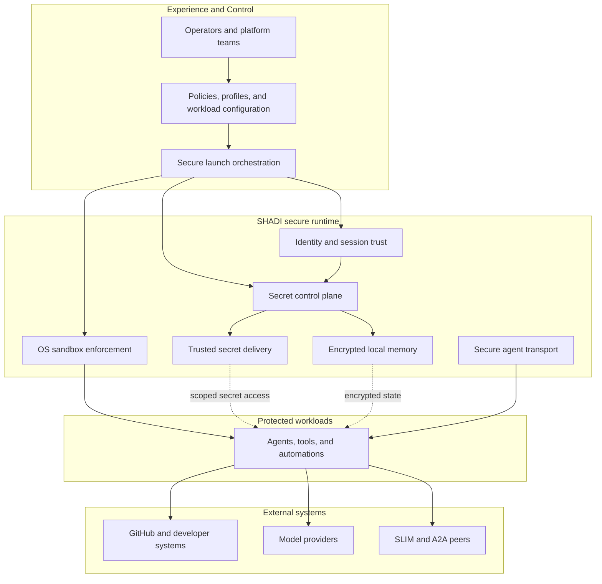

# Architecture

SHADI (Secure Host Agentic AI Dynamic Instantiation) is a secure host runtime for
interactive, autonomous agents. It combines secure secret storage, verified
identity, and kernel-enforced sandboxing to reduce the blast radius of agent
actions and prevent unauthorized data access or exfiltration.

## Goals
- Run dynamic, interactive agents with least-privilege access.
- Protect secrets at rest and limit access to verified sessions.
- Enforce kernel-level restrictions so unauthorized operations are blocked by the OS.
- Provide secure, low-latency agent-to-agent messaging via SLIM/A2A,
  DID-authenticated and MLS-encrypted.
- Keep platform support across macOS, Windows, and mobile targets.

!!! warning "Non-goals"

    - Protect against a fully compromised host OS or kernel.
    - Provide complete metadata privacy for network traffic in v1.
    - Replace upstream MLS or OS keystore implementations.

## Architecture overview

SHADI as four layers — control, secure runtime, protected workloads, and the
external systems they're allowed to reach once trust checks pass:

The system can be read as four presentation layers:

- **Experience and control**: operators, policies, profiles, and `shadictl` define the launch contract before a process starts.
- **Secure runtime**: identity, secret control, trusted delivery, sandboxing, transport, and encrypted memory enforce that contract during execution.
- **Protected workloads**: agents, tools, and automations run inside the approved runtime boundary.
- **External systems**: workloads connect to GitHub, model providers, and SLIM/A2A peers only after policy and trust checks are in place.

## Core components

### 1) Secrets layer
- **OS keystores**: Keychain (macOS/iOS), DPAPI/CNG (Windows), Keystore (Android),
  Secret Service (Linux).
- **1Password backend** (optional): Cross-platform secret storage via the `op` CLI.
  Enabled with the `onepassword` Cargo feature and `SHADI_SECRET_BACKEND=onepassword`.
  Supports team/shared vaults and headless CI via `OP_SERVICE_ACCOUNT_TOKEN`.
- **Access control**: Secrets are accessed only after DID/VC verification.
- **Memory safety**: Secrets are wrapped in `SecretBytes` and zeroized on drop.
- **OpenPGP parsing**: `shadictl` uses `sequoia-openpgp` to ingest keys without calling OS `gpg`.

### 1b) Identity derivation and provenance
- **Deterministic derivation**: Agent keys are derived from human identity material
  through a fixed KDF pipeline.
- **KDF details**: HKDF-SHA256 with salt `shadi-agent-derive`, IKM from human
  source bytes (`gpg` or `seed`), and `agent_name` as HKDF info.
- **Output model**: 32-byte Ed25519 seed -> local agent keypair -> `did:key` DID document.
- **Provenance binding**: Optional `{prefix}/{agent}/human_did` binding allows
  explicit linkage from derived agent identity back to a stored human DID.
- **Verification command**: `verify-agent-identity` recomputes derived key + DID
  and compares with stored values; can also enforce human DID binding checks.

### 2) Sandbox layer
- **macOS**: Seatbelt profile enforcement for filesystem and network policies.
- **Windows**: AppContainer + ACL allowlists + Job Objects (kill-on-close).
- **CLI**: `shadi` provides JSON policy loading, profile defaults, optional command blocklists, process-scoped secret disclosure, and trusted secret delivery.
- **Portable launcher model**: `shadi` supports built-in profiles
  (`strict`, `balanced`, `connected`) for portable secure launch defaults.
- **Launch-time enforcement**: Policy is resolved before the agent process starts, so the sandbox is not a prompt-level suggestion that the agent can rewrite from inside the session.
- **Operational hardening**: macOS launcher support now resolves relative paths before emitting Seatbelt rules and accounts for required local IPC paths such as 1Password, SLIM runtime state, and temporary trusted-secret broker endpoints.

### 3) Memory layer
- **Local encrypted store**: SQLCipher-backed SQLite for portable, on-device memory.
- **Key management**: Encryption keys live in SHADI secrets (keychain backed).
- **Agent usage**: workloads running on SHADI can persist local state in the encrypted store.

### 4) Transport layer
- **Identity**: `shadi_identity` authenticates every SLIM peer with a per-agent
  DID-JWT (`SHADI_SLIM_AUTH=did`) instead of a shared secret; group admission
  is checked against an explicit DID allow-list.
- **SLIM/A2A**: point-to-point and moderator/participant group sessions
  additionally enable MLS session encryption for confidentiality and
  integrity between agents (`agent_transport_slim`, `shadictl slim create`/
  `invite`/`join`).
- **Verified sessions**: Messages are only sent/received after DID/VC checks.

### 5) Secret delivery and policy framework

SHADI has a launch-time secret-delivery framework with exact executable
matching: `process_inject_keychain` (explicit disclosure), `process_trusted_secret`
(process-scoped trusted delivery), and `process_secret_policy` (action-based
rules, including `delegate-to-child` final-consumer delivery on Unix/macOS).

For the full rule shapes, the security rationale behind final-consumer
delivery, and the prompt-injection boundary, see
[Security Notes → Secret delivery and disclosure modes](security.md#secret-delivery-and-disclosure-modes).

??? note "Code map (file paths by layer)"

    **Secrets layer**

    - `crates/agent_secrets/src/lib.rs`: `SecretStore` trait, errors, and default store.
    - `crates/agent_secrets/src/agent.rs`: `AgentSecretAccess` gates reads/writes on verification.
    - `crates/agent_secrets/src/memory.rs`: `SecretBytes` zeroization wrapper.
    - `crates/agent_secrets/src/platform`: platform keychain backends.
    - `crates/agent_secrets/src/platform/macos.rs`: Keychain storage + key registry for listing.
    - `crates/agent_secrets/src/platform/onepassword.rs`: 1Password backend via `op` CLI.
    - `crates/shadictl/src/identity_command.rs`: OpenPGP/GPG ingestion and DID derivation commands.
    - `crates/shadictl/src/secrets_command.rs`: secret store list/get helpers.

    **Identity derivation**

    - `crates/shadictl/src/identity_command.rs`: `derive-agent-did`, `derive-agent-identity`,
      `verify-agent-identity`, and derivation helpers, delegating to `shadi_identity::AgentIdentity::derive`.

    **Sandbox layer**

    - `crates/shadi_sandbox/src/policy.rs`: policy model and helpers.
    - `crates/shadi_sandbox/src/platform`: OS-specific sandbox enforcement.
    - `crates/shadictl/src/cli_types.rs`: CLI arg parsing.
    - `crates/shadictl/src/policy_helpers.rs`: profile defaults and policy resolution.

    **Memory layer**

    - `crates/shadi_memory/src/lib.rs`: SQLCipher store and query helpers.
    - `crates/shadictl/src/memory_command.rs`: `shadictl memory` helper.
    - `crates/shadi_py/src/lib.rs`: SQLCipher bindings.

    **Transport layer**

    - `crates/agent_transport_slim/src/lib.rs`: transport adapter, verifier gating, and native SLIM session bootstrap.
    - `crates/agent_transport_slim/src/bin/slim-stdio-bridge.rs`: standalone stdio bridge helper; the same bridge engine is now used directly by shadictl for in-sandbox SLIM sessions.

    **Secret delivery and policy framework**

    - `crates/shadictl/src/trusted_secret_delivery.rs`: secret resolution, exact-program matching, broker lifecycle, and delegated child verification.
    - `crates/shadictl/src/sandbox_snapshot.rs`: launch orchestration, runtime policy augmentation for broker endpoints, and trusted-secret post-spawn delivery.
    - `crates/shadi_sandbox/src/policy.rs`: minimal-profile and local Unix socket opt-in controls.

## Language bindings

SHADI exposes a Python extension for secrets, SQLCipher memory, and sandbox
execution, backed by `crates/shadi_py/src/lib.rs`. See
[API Guide → Language Bindings](api_integration.md#language-bindings) for the
full Rust and Python surface with examples.

## CLI policy resolution

The CLI combines profile defaults, policy file settings, and explicit flags:

- Profile defaults are loaded first (`balanced` by default).
- Policy file values are merged next.
- CLI flags override or extend resulting policy.
- The effective policy can be printed with `--print-policy`.

## Next steps

- Review the full threat model, secret-delivery rationale, and residual risks in [Security Notes](security.md).
- Put this into practice with [Sandbox and Policies](sandbox.md) and the [CLI Reference](cli.md).
- Integrate into an agent or app via the [API Guide](api_integration.md).
- See the multi-agent coordination layer and general-purpose A2A agent interconnect in [AgentBridge](agentbridge.md).
