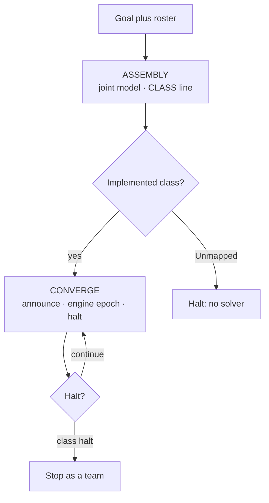

# ASSEMBLY and CONVERGE

ASSEMBLY and CONVERGE are the two **group** phases in
[SHADI MAS](shadi-mas.md) (`shadi_mas`). A team first builds a shared
model of a problem, then exchanges local state while a class engine
applies the update and the team decides whether to stop.

The protocol is not limited to numbers. A class may use scores, orders,
stock, code artifacts, or another local state the engine understands.
What must stay true is the group: peers model together, then converge
together. `agentbridge coordinate` drives both phases.

## Why these names

The names must read as group work.

| Name | What the team does | Why not a shorter word |
|------|--------------------|------------------------|
| **ASSEMBLY** | Jointly understand the problem and propose a system model | *Model* can be one agent writing a formalization alone |
| **CONVERGE** | Announce local state together, accept the engine update, and halt together | *Solve* can be one agent producing the next state alone |

A single agent can model or solve. ASSEMBLY and CONVERGE require peers.

## What this is not

- Not hop-local `COMMIT proposal=`. CONVERGE announces current local
  state in the form the class requires; the **engine** applies the class
  update after a full epoch.
- Not a closed taxonomy. Preference, cascade, resource, and development
  are **implemented examples**. ASSEMBLY may name another class.
- Not “numeric MAS.” Scalar announce is how some example engines speak.
  A class whose state is an artifact, a plan, or another object still
  uses these two phases.
- Not an LLM theorem. Mapping a prompt to `preference` does not prove
  Jacobi or the paper’s preference-linear result. `proves_llm_mas` is
  false.
- Not the two-line Rust fifo demo. That loop is [round-robin collab](demos/collab-rust.md).
- Not a skill pasted into `--text`. Peers load Agent Skills; the hop only
  names the phase.

## Two phases



| Phase | Who speaks | Who computes the next state | Exit |
|-------|------------|-----------------------------|------|
| ASSEMBLY | Every peer | Nobody. `AssemblySession` only infers a class | A `PatternKind`, or `Unmapped` |
| CONVERGE | Every peer announces local state and may vote | The class engine, after a full epoch | That engine’s halt |

A class is implemented when SHADI has an engine for it. Today that is
`development` (code artifacts) and the three paper examples
(`preference`, `cascade`, `resource`). Any other `CLASS` token is
`Unmapped`. CONVERGE must not start on `Unmapped`.

`--assembly` runs ASSEMBLY first. `--pattern` selects or seeds the
class. After ASSEMBLY, `coordinate` starts the matching CONVERGE engine
or refuses if the class is unmapped.

## ASSEMBLY

ASSEMBLY is joint modeling. Peers debate in natural language: who the
agents are, what they exchange, and what “better” means. They may offer
a formalization. They **may** name a class that SHADI does not implement.

### Line protocol

Each peer ends with exactly one line:

```text
CLASS <name>
```

Then `NEXT <peer>` or `DONE`. No other protocol text.

`<name>` is an implemented token (`development`, `preference`,
`cascade`, `resource`) or another short token (`matching-markets`, …).
A token SHADI does not implement becomes `PatternKind::Unmapped`.

### Inference

`AssemblySession` is soft. Prose is the debate; the hypothesis is
inferred.

1. A `CLASS <name>` or `CLASS=<name>` line wins.
2. Otherwise keywords may vote among the paper examples (for example
   “neighbor” / “quadratic” → preference; “inventory” / “pipeline” →
   cascade; “extraction” / “quota” → resource). A tie or no hits leaves
   the last stable hypothesis unchanged.
3. `remap()` clears the hypothesis and re-ingests. Use that when the
   team changes its mind.

Do not leak a global optimum or a full instance during ASSEMBLY. For the
paper examples that means no `z*`, full demand path, bullwhip, or
terminal stock forecast.

## CONVERGE

CONVERGE is a group solve. Each epoch:

1. Every peer sees a **local** view and announces its current state in
   the form the class requires.
2. The matching engine applies the class update once the epoch is full.
3. The team records progress (an improvement signal, a quorum, or
   another class-specific check).
4. Peers vote whether to continue, when the class uses ballots.
5. The team halts together.

The agent does **not** invent the next state. The engine does.

### Class-specific announce

The hop prints `phase=CONVERGE` and the local view. The announce *form*
belongs to the class.

**Scalar paper examples** (preference, cascade, resource):

```text
ANNOUNCE value=<f64> agent=<id> epoch=<k>
VOTE CONTINUE
```

or `VOTE STOP`. Then `NEXT <peer>` or `DONE`. A missed parse falls back
to the engine’s current local value. A skill miss is announce versus
**current** engine state, not versus the formula result.

`COMMIT proposal=` is still parsed as an announce alias so older
transcripts do not break. New hops should use `ANNOUNCE`.

**Development** (code artifacts): each peer proposes `ExternalBytes`
and endorses via `ToolResult`. Halt is quorum on the winning artifact,
or `--max-rounds`. See
[AgentBridge → DevelopmentEngine](agentbridge.md#developmentengine-the-coordination-core).

A future class uses the same phase and a new announce form. Do not
force every class through `value=<f64>`.

### Halt on the paper examples

Those three engines share `ConvergeController`. It stops on the first
of:

| Halt | Meaning |
|------|---------|
| `MajorityStop` | Strict majority of the roster voted `STOP` this epoch |
| `Plateau` | Metric failed to improve for `plateau_k` epochs (default 3 in `coordinate`) |
| `NoSolution` | Plateau after at least one compared epoch with no improvement |
| `PaperHorizon` | Epochs reached the class horizon |
| `Unmapped` | ASSEMBLY named a class with no engine |

Preference treats lower metric as better (`‖z − z*‖₂`). Cascade uses
accumulated cost (lower is better). Resource uses remaining stock
(higher is better). Other classes may halt on a different signal.

## Implemented example classes

These are examples, not a closed set. ASSEMBLY may name something else;
that is a successful modeling outcome and an `Unmapped` CONVERGE
refusal.

| Class | `PatternKind` | Local state | Engine update | Default horizon in `coordinate` |
|-------|---------------|-------------|---------------|----------------------------------|
| Development | `Development` | code artifact | Endorse proposals; most votes wins | `--max-rounds` |
| Preference aggregation | `Preference` | current `z_i` | Synchronous Jacobi on the neighbor inbox | `--max-rounds` |
| Supply-chain cascades | `Cascade` | last order | Order-up-to + smoothing on engine-owned plant | `min(--max-rounds, demand length)` (paper demand is 8) |
| Sustainable resource | `Resource` | last extraction `e_i` | Dual step (`λ`, clip `e_i`) and stock update | `min(--max-rounds, 12)` |

### Development (`DevelopmentEngine`)

`--pattern development` (the `coordinate` default) is CONVERGE for a
shared code artifact. Peers propose implementations and endorse one.
Finalization selects the artifact with the most endorsements when
quorum is met.

### Preference (`PreferenceEngine`)

Line graph, private scores `c`, coupling `β` (default `0.75`). Each
epoch every node announces `z_i`. When the inbox is complete the engine
sets, simultaneously (Jacobi, not Gauss–Seidel):

```text
z_i ← (c_i + 2β Σ_{j∈N_i} z_j) / (1 + 2β d_i)
```

The unique fixed point is `z* = (I + 2β L)⁻¹ c`. This is **not** a
median vote (that is a different object in the paper).

### Cascade (`CascadeEngine`)

Stages in a chain. Downstream orders become upstream demand. Paper
constants: lead `L = 2`, target inventory `I = 8`, demand
`[4, 4, 4, 8, 8, 8, 4, 4]`, smoothing `0.5`. Agents announce
`last_order`. The engine owns inventory and pipeline.

### Resource (`ResourceEngine`)

Peers share a renewable stock. Paper constants: `R⁰ = 24`, capacity 30,
regen `0.2`, quota fraction `0.25`, `α = 0.35`, `η = 0.4`, 12 rounds.
Agents announce last extraction. Coordinated `α > 0` retains more stock
than uncontrolled greedy on the paper instance.

## Agent Skills

Peers are instrumented with Agent Skills, using the same install map as
[`skills/agentbridge`](https://github.com/agntcy/shadi/tree/main/skills/agentbridge).
Copy the folder. The folder name must match. Do not paste `SKILL.md`
into `--text`.

| Skill | Folder | When it applies |
|-------|--------|-----------------|
| ASSEMBLY | [`skills/assembly/`](https://github.com/agntcy/shadi/tree/main/skills/assembly) | Hop prints `phase=ASSEMBLY` |
| CONVERGE | [`skills/converge/`](https://github.com/agntcy/shadi/tree/main/skills/converge) | Hop prints `phase=CONVERGE` and the class uses a printed local view |

`skills/converge` as shipped teaches the scalar announce / `VOTE`
form. A class with a different state type (including development)
keeps the same phase name and uses that class’s announce form.

| Host | Destination |
|------|-------------|
| Claude Code | `~/.claude/skills/<name>/` or `.claude/skills/<name>/` |
| Cursor | `.cursor/skills/<name>/` |
| GitHub Copilot | `~/.copilot/skills/<name>/` |
| Goose | `~/.config/goose/skills/<name>/` |
| OpenCode | `~/.config/opencode/skills/<name>/` |
| Codex / others | that host’s skills directory, same folder name |

A mesh job copies both folders into the job-local
`$XDG_CONFIG_HOME/goose/skills/` tree. The hop names the phase; it does
not inline the skill body.

Do not invent agentbridge or Goose flags in the skill text.

## CLI

```bash
# ASSEMBLY, then CONVERGE on whatever class the team names
agentbridge coordinate \
  --goal "implement a JSON parser in Rust" \
  --agents claude-code,copilot,codex \
  --pattern unmapped \
  --assembly \
  --quorum 2 \
  --max-rounds 5

# Skip ASSEMBLY when the class is already chosen
agentbridge coordinate \
  --goal "stages in a chain order from inventory" \
  --agents slim:goose-0,slim:goose-1,slim:goose-2,slim:goose-3 \
  --pattern cascade \
  --max-rounds 8 \
  --slim-endpoint 127.0.0.1:47357
```

| Flag | Role |
|------|------|
| `--pattern development` | Default. CONVERGE on `DevelopmentEngine` |
| `--pattern preference\|cascade\|resource` | CONVERGE on that paper engine |
| `--pattern unmapped` | Force ASSEMBLY; CONVERGE starts only if an implemented class is inferred |
| `--assembly` | Run ASSEMBLY first even when `--pattern` already names a class |
| `--max-rounds` | CONVERGE horizon cap |
| `--quorum` | Endorsement quorum for `DevelopmentEngine` |

`--agents` specs are the same as the rest of agentbridge (`goose`,
`slim:<id>`, …). Listeners still come from `agentbridge register`.
Identity is DID-only; see
[AgentBridge → DID authentication](agentbridge.md#did-authentication).

In the CLI, `PatternKind::is_converge_class()` means “use the scalar
paper driver (`ConvergeController`)”. Development is still CONVERGE; it
uses the artifact driver.

## Honest claims

| Claim | Holds when | Does not mean |
|-------|------------|---------------|
| Hold equals Ideal | A paper CONVERGE engine applies the published update on the intended class, for that class horizon | The LLM discovered the formula; every class has an Ideal |
| ASSEMBLY mapped the intended class | `CLASS` / keywords inferred the intended label | The class set is closed, or the map is a proof |
| Unmapped is success for modeling | The team named a class SHADI does not solve | A solver ran |
| Mesh is live | Peers admitted, every peer recvs, NEXT/HANDOFF on the ring, hops use `slim://` | Hold vs Ideal |

Do not claim Gemma (or any other model) discovered Jacobi or proved
preference-linear.

## Types and files

| Item | Location |
|------|----------|
| `ProtocolPhase::{Assembly, Converge}` | `crates/shadi_mas/src/types.rs` |
| `PatternKind`, `ConvergeBallot`, `ConvergeHalt`, `ConvergeSignal` | same |
| `AssemblySession`, `infer_pattern` | `crates/shadi_mas/src/assembly.rs` |
| `ConvergeController`, `ConvergeSurface` | `crates/shadi_mas/src/engines/converge.rs` |
| Class engines | `engines/development.rs`, `preference.rs`, `cascade.rs`, `resource.rs` |
| CLI driver | `crates/agentbridge_cli/src/commands/coordinate.rs` |
| Skills | `skills/assembly/`, `skills/converge/` |

## Next steps

- Runtime, engines, and adapters: [SHADI MAS](shadi-mas.md).
- Install listeners and DID auth from [AgentBridge](agentbridge.md).
- For transport and group admission see [SLIM and A2A](slim_a2a.md).
