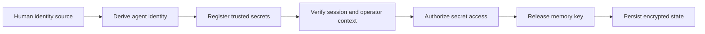
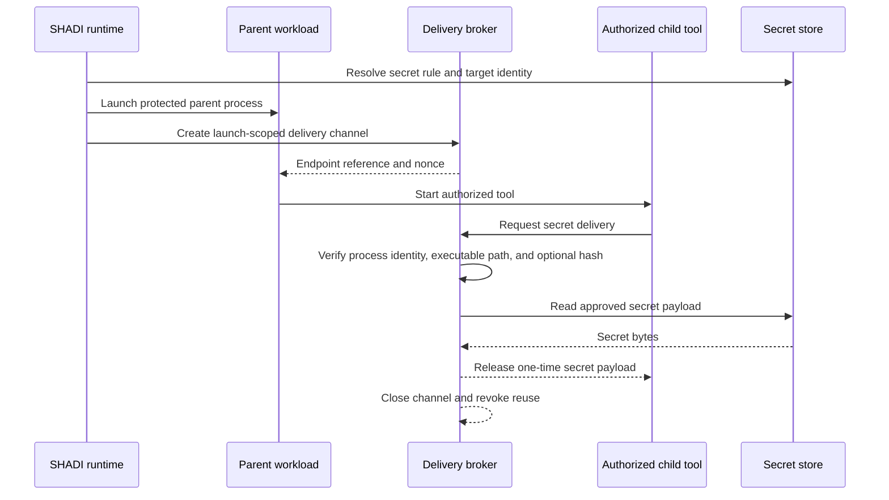

# Security Notes

This library targets confidentiality for agent secrets at rest and in memory.
It does not assume a hostile OS for v1.

!!! info "Reporting a vulnerability"

    Report security issues privately to [security@agntcy.org](mailto:security@agntcy.org),
    not via the public issue tracker. The project tracks and publishes
    advisories in the [GitHub Security Advisories space](https://github.com/agntcy/shadi/security/advisories) —
    see [SECURITY.md](https://github.com/agntcy/shadi/blob/main/SECURITY.md) for
    the full disclosure and coordination process.

OpenPGP key handling is performed in-process via `sequoia-openpgp` rather than
shelling out to `gpg`.

## Agent key derivation

SHADI derives local agent keys from human identity material using:

- KDF: `HKDF-SHA256`
- Salt: `shadi-agent-derive`
- IKM: human source bytes — see the sources below
- Info: agent name

The 32-byte HKDF output becomes an Ed25519 private key seed. SHADI stores the
derived public key and computes `did:key` from that key.

### Human identity sources

| `--source` | IKM | Human DID |
|---|---|---|
| `gpg` | OpenPGP secret-key material as stored | `did-from-gpg`, or `did-from-github` (Ed25519 GPG key only) |
| `ssh` | the key's 32-byte Ed25519 seed | `did-from-ssh`, or `did-from-github --key-type ssh` |
| `seed` | the stored bytes verbatim | none — the root is not a published key |

Sources are not interchangeable: each produces different agent DIDs for the same
agent name, because the IKM differs.

The `ssh` source uses the key's **seed** rather than the key file's bytes,
because the OpenSSH container is not a stable encoding — re-encrypting with a new
passphrase rewrites the file while the key is unchanged. Deriving from the file
would silently change every agent DID. (`gpg` predates this and hashes its stored
material, so re-exporting a GPG key can change its derived agents.)

Only `ssh-ed25519` is accepted. Hardware-backed `sk-ssh-ed25519` keys expose no
private key and cannot root a derivation.

An SSH passphrase is read from the secret store
(`--ssh-passphrase-secret <ref>`) or `SHADI_SSH_PASSPHRASE`, never from a command
-line argument, which would be visible to any local process via `ps`.

Because an SSH key is normally published at `github.com/<user>.keys`, the human
DID derived from its public half is verifiable by anyone against the account that
claims it — the private half never leaves the machine. That public binding is
what "sign in with GitHub" contributes; it is not secret material. What it does
**not** yet establish is that a given agent belongs to that human at SLIM
admission time — see the note below.

## Human-to-agent linkage verification

Use `shadictl verify-agent-identity` to recompute the expected agent key and
DID from the same human source and compare them to stored values.

If a human DID binding is stored (`{prefix}/{agent}/human_did`), verification
can additionally assert that the binding matches a specific human DID key.

This check is local and offline. On the wire, SLIM admission verifies the *agent*
DID against the `SLIM_MEMBER_DIDS` allow-list; `SLIM_HUMAN_DID` is reported for
display and is not verified, so a peer cannot currently prove which human an
agent belongs to. Tracked in agntcy/shadi#141.

This is the trust bootstrap path end to end — from human identity material to
gated secret and memory access:

1. Human identity material is imported or derived.
2. SHADI stores agent keys, DIDs, and optional provenance bindings in the secret store.
3. Session verification gates later reads.
4. The SQLCipher memory key is retrieved through the same secret-control path rather than living in plaintext config.

## 1Password backend

When `SHADI_SECRET_BACKEND=onepassword` is set, secrets are stored in a
1Password vault instead of the OS keychain. The backend shells out to the `op`
CLI (1Password CLI v2). No secrets are cached in memory beyond the lifetime of
each operation.

- Items are stored as Secure Notes with base64-encoded content, tagged `shadi`.
- For CI/headless environments, set `OP_SERVICE_ACCOUNT_TOKEN` (never stored
  by SHADI; consumed directly by `op`).
- The vault name defaults to `shadi` and can be overridden via `SHADI_OP_VAULT`.

## Secret delivery and disclosure modes

SHADI now separates secret storage from secret delivery.

The important distinction is not only whether a secret exists in the store, but
which executable is allowed to receive it and by what mechanism.

Current launch-time modes:

- `--inject-keychain` and `process_inject_keychain`: explicit disclosure as an environment variable.
- `process_trusted_secret`: process-scoped trusted delivery to the launched executable.
- `process_secret_policy`: action-based rules, including `delegate-to-child` for Unix/macOS final-consumer delivery.

### Secret actions

Policy should be expressed in terms of actions on a secret rather than a coarse secret category.

- `disclose`: the process may read the secret value directly.
- `use`: the policy may represent a narrower operation that depends on the secret without implying ambient plaintext disclosure.
- `delegate-to-child`: the process may request that SHADI deliver the secret to
  a specific child process, but the parent does not receive the secret.
- `sign` or `authenticate`: the process may invoke a narrower operation backed
  by the secret without receiving the raw secret when the platform integration
  supports that shape.

### Final-consumer delivery rule

The core enforcement rule is:

> A secret must be delivered by SHADI directly to the final authorized consumer
> process, not inherited through a parent process and not placed into a general
> environment visible to unrelated descendants.

This rule applies even when the process tree is parent-driven:

1. An agent or parent tool requests launch of child tool `T`.
2. SHADI validates that `T` is allowed to receive action `A` on secret `S`.
3. SHADI verifies the exact executable identity for `T`.
4. SHADI launches or mediates the final consumer boundary.
5. SHADI delivers the secret to `T` one time.
6. The parent does not receive the secret as an env var, inherited fd, handle,
   or reusable fetch token.

### Why this matters

Two risks need different controls:

- **Wrong-process disclosure**: a secret reaches a parent or sibling process that was not the intended consumer.
- **Prompt-injection misuse**: an LLM-facing process that legitimately sees a secret is induced to exfiltrate it.

SHADI's current policy framework primarily improves the first risk by keeping
secret rules bound to the exact launched executable and, for delegated
Unix/macOS delivery, to a verified child executable plus a one-shot broker
protocol.

Prompt injection is a separate concern from wrong-process delivery:

- Process-boundary controls decide **which process can receive a secret**.
- Prompt-injection controls decide **whether that process should ever receive a
  raw secret at all**.

LLM-driven executables should default away from `disclose` whenever a safer
action is available — deterministic or tightly scoped tools may receive
`disclose` when necessary, but LLM-driven agents should more commonly receive
`delegate-to-child` or a narrower `use` capability. High-value provider
credentials should prefer mediation patterns where SHADI or a trusted adapter
performs the authenticated action and returns only the result.

### Current platform behavior

- Unix/macOS trusted delivery uses a launch-scoped broker endpoint, a companion nonce env (`*_NONCE`), peer-process verification, and one-shot release semantics.
- macOS temporarily opts into local Unix socket permissions only for launches that require trusted-secret delivery.
- Windows currently supports direct trusted-secret delivery through a compatibility inherited-handle path.
- Windows direct trusted-secret rules can optionally pin the launched executable hash with `exec_sha256` to avoid path-only trust.
- Windows ACL allowlist changes are journaled to disk before mutation and replayed on the next sandbox startup if a previous `shadictl` process crashes before cleanup. The journal directory is locked to owner + SYSTEM with a protected DACL, and each journal entry carries an HMAC-SHA256 tag verified before replay to prevent tampering.

### Compatibility mode

The existing env-injection and inherited-handle paths may still be kept as
explicit compatibility mechanisms, but they should be documented as disclosure
mode rather than the target secure design:

- env injection: explicit `disclose` to the target process,
- inherited Windows handles: compatibility path for direct trusted delivery,
- brokered final-consumer delivery: preferred secure path.

### Policy intent

Treat environment injection as explicit disclosure, not as the default secure
path. Prefer final-consumer delivery when the parent process only needs to
launch a child tool rather than directly hold the credential.

## agentbridge listeners

`agentbridge register` exposes a local coding tool as an A2A service over SLIM.
Every incoming task is forwarded to that tool's subprocess.

!!! danger "Registered listeners are a remote code-execution surface"

    Any peer that can reach `agntcy/shadi/<tool>-a2a` can drive the local tool
    (some adapters, such as `copilot`, run with `--allow-all-tools`).

Controls:

- SLIM peers authenticate with a per-agent DID (`SHADI_SLIM_AUTH=did`,
  `SLIM_HUMAN_SEED`), verified against an explicit `SLIM_MEMBER_DIDS`
  allow-list — shared secrets are not accepted for agentbridge listeners
  (`shadi_identity::require_did_auth_from_env` rejects anything else). See the
  [Secure Agent Group Demo](demos/did-agent-group.md) for the full admission
  model. This decides *who* may send a task.
- Transport is mutually authenticated with SLIMRPC over TLS; keep the CA bundle
  private to trusted peers.
- **Enforced**: `register --slim-endpoint` refuses to start unless it is running
  under a SHADI [sandbox](sandbox.md) with network blocked by default
  (`shadi_sandbox::sandbox_enforced_from_env`). Seatbelt/Landlock/AppContainer
  sandboxes are kernel-enforced and inherited by child processes, so wrapping
  `agentbridge register` in `shadictl` confines whatever CLI tool the adapter
  spawns to run a task — agentbridge has no sandboxing logic of its own, it
  leans entirely on `shadictl`'s existing enforcement. This decides *what* a
  task can do once it runs. See
  [AgentBridge → Security model](agentbridge.md#security-model).

## Threat model

### Secrets and credential theft
- **Stopped**: Reading secrets without verification.
- **Stopped**: Exfiltration of secrets from disk when keystore access is denied.
- **Stopped**: Accidental logging of secrets by non-verified sessions.
- **Mitigated**: In-memory exposure via zeroization and limited lifetime.

### Identity spoofing / provenance ambiguity
- **Stopped**: Undetected key substitution when `verify-agent-identity` is used.
- **Mitigated**: Agent ownership ambiguity via stored `human_did` binding + verification.

### Filesystem abuse
- **Stopped**: Accessing paths outside allowlists (kernel enforcement).
- **Stopped**: Writing to disallowed paths in sandboxed processes.
- **Mitigated**: Destructive commands via CLI blocklist.

### Network abuse
- **Stopped**: Network access when `net_block` is enabled.
- **Mitigated**: Unapproved endpoints with best-effort `net_allow` guard for
  Python sandbox runners.

### Agent-to-agent data leakage
- **Stopped**: Unverified peers joining a session; DID-JWT authentication and
  (for groups) an explicit member allow-list gate admission.
- **Stopped**: Unauthorized peers reading messages; MLS provides confidentiality
  on point-to-point and group SLIM sessions.
- **Stopped**: Message tampering; MLS provides integrity/authentication.

### Privilege escalation
- **Mitigated**: Prompt-level or path-level agent reasoning by applying sandbox policy before launch.
- **Mitigated**: Running blocked commands via CLI blocklist when that feature is used.
- **Mitigated**: Kernel-level constraints remain even if the agent tries to evade application-layer logic.

### Threat-to-control mapping

| Threat | Control | Outcome |
| --- | --- | --- |
| Unverified secret access | DID/VC verifier + `AgentSecretAccess` | Blocked |
| Secret theft at rest | OS keystore storage | Blocked |
| Secret exfiltration in sandbox | OS sandbox + net block | Blocked |
| Unauthorized file access | Seatbelt/AppContainer allowlists | Blocked |
| Destructive commands | CLI blocklist | Mitigated |
| Peer/agent impersonation on SLIM | DID-JWT auth + member allow-list | Blocked |
| Message interception | MLS in SLIM | Blocked |
| Message tampering | MLS integrity | Blocked |
| Agent identity substitution | HKDF derivation + verify-agent-identity | Blocked (with verification) |
| Process escape | Kernel enforcement | Mitigated |

!!! warning "Non-goals and residual risks"

    - Protecting against a fully compromised host OS or kernel-level malware.
    - Metadata privacy beyond message content when using SLIM/MLS, or network traffic metadata (timing, sizes, endpoints) in general.
    - ACL changes on Windows could be interrupted before rollback in a crash.
    - Application-level path deny rules are weaker than OS-enforced sandbox restrictions; do not rely on path matching alone for high-assurance policy.

!!! tip "Deployment guidance"

    - Prefer running agents under the sandbox with a JSON policy file.
    - Use explicit disclosure only when a demo or workload truly needs the secret in the parent process, and prefer process-scoped or delegated trusted delivery where possible.
    - Rotate secrets and use short-lived tokens whenever possible.

## Next steps

- See the high-level system model in [Architecture](architecture.md).
- Put this into practice with [Sandbox and Policies](sandbox.md).
- Review agentbridge's specific threat model in [AgentBridge → Security model](agentbridge.md#security-model).
